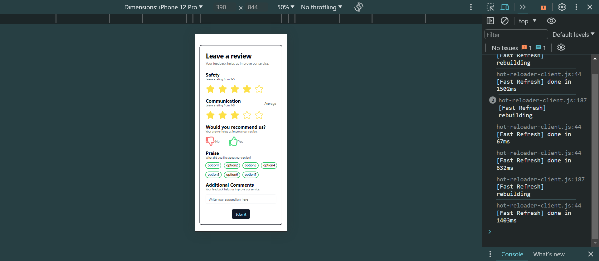
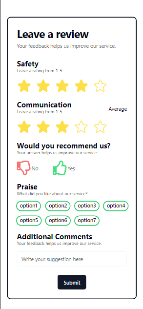
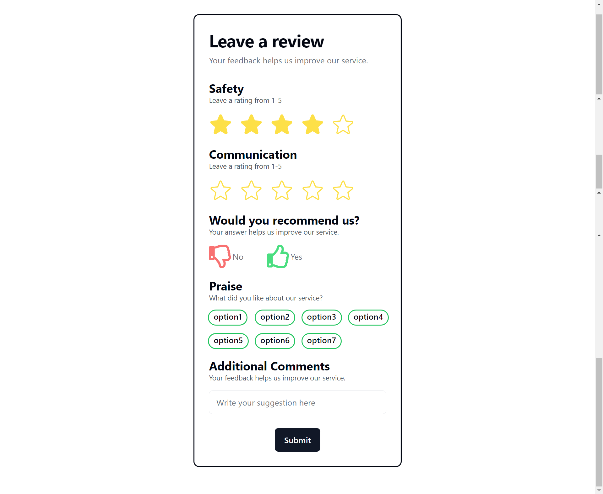
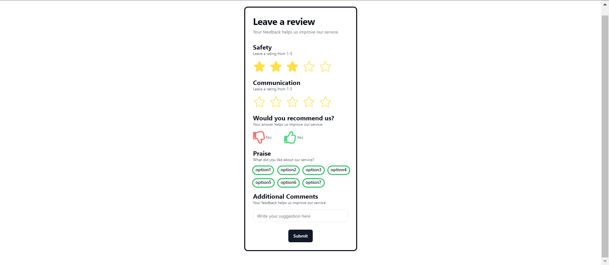
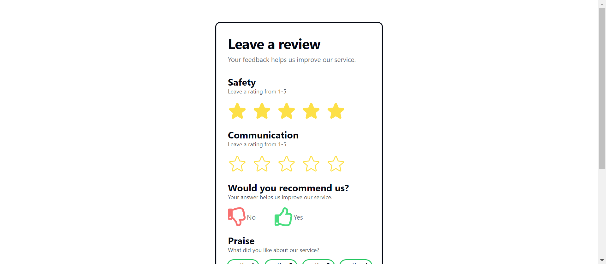

Sure, here's a brief GitHub README template for your feedback component. I've included placeholders for screenshots:

---

# Ayuvya Ayurveda Feedback Component

## Overview

This feedback component is designed for Ayuvya Ayurveda to collect user feedback on safety, communication, and overall experience. Users can rate services, provide specific praises, and leave additional comments. Built with React and styled with Tailwind CSS.

## Features

- Rate safety and communication.
- Recommend services with a simple click.
- Select specific aspects to praise.
- Leave additional comments.
- Validate user inputs before submission.
- Display feedback as toast notifications.

## Screenshots









## Installation

To use this feedback component in your project, follow these steps:

1. Clone the repository: `git clone https://github.com/vivekkum-ar/Assignment-ayuvya.git`
2. Install dependencies: `npm install`
3. Run the development server: `npm start`

## Usage

1. Import the `Rating` component into your project.
2. Place the component where you want to collect feedback.

```jsx
import Rating from 'path/to/Rating';

function App() {
  return (
    <div className="App">
      <Rating />
    </div>
  );
}

export default App;
```

## License

This project is licensed under the [MIT License](LICENSE).

---

Thanks for viewing !
